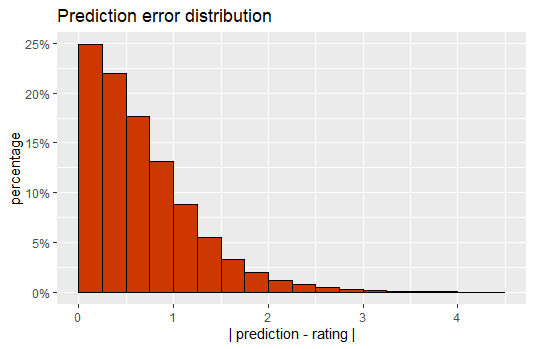

```{r setup, include=FALSE}
knitr::opts_chunk$set(echo = FALSE, message = FALSE, warning = FALSE)
```

## Introduction

This is a report on a model that has been created for making movie recommendations based on the [MovieLens 10M Dataset](https://grouplens.org/datasets/movielens/10m/). The data set contains roughly 10 million movie ratings on 10,000 movies by 70,000 users. It has columns containing the following information: user ID, movie ID, rating, rating time stamp, movie title, and genres. The year the movie was released is embedded within the title. 

The goal of the project is to use the existing data to create a model that predicts ratings on user movie combinations that are not in the set. The data is first downloaded and partitioned into a training set and test set. All training is performed on the training set, with the test set reserved strictly for a final test of the model. This ensures that the model is not fitted to the test data and produces an honest measure of the model's accuracy. Ratings range from 0.5 to 5, and are in 0.5 increments.

The training process involves exploring the data while looking for correlations between the different variables. The training set is further partitioned into training and test sets in order to assess the accuracy of the model as it evolves. Our starting point is the overall average of all ratings. From there, we incorporate tendencies of individual movies and users. Next, we regularize these tendencies using K-fold cross validation to determine the best tuned parameter, lambda. Then we account for tendencies among genres. Finally, we explore temporal influences of values such as the month and the hour the rating was submitted, as well as how old the movie is.

The value that we use to measure the accuracy of our model is the Root Mean Square Error, or RMSE. To calculate this, we sum up the squares of the differences between our predictions and the actual ratings, then take the square root of the average. The goal is to minimize the RMSE, and get it down below 0.86490.

$$
RMSE = \sqrt{\frac{1}{N}\sum_{k=1}^{N}{(\hat{y}_k - y_k)^2}}
$$

## Methods

We begin by downloading the data set and partitioning it into a training set and a test set. The code for achieving this can be found [here](https://github.com/oneskychai/MovieLens/blob/trunk/create_data_sets.R). Next, we load our necessary libraries:

```{r loading libs, echo = TRUE}
library("tidyverse")
library("lubridate")
library("caret")
```

We use the `createDataPartition()` function from the **caret** package to further partition the training set into smaller training and test sets using a 90/10 split. Now we are ready to begin exploring the data.

### The baseline average, $\mu$

We calculate the average rating over the whole training set, about 3.51, and use this as a baseline for our model. If we simply guess this average for every rating, our model produces an RMSE of about 1.06 on the working test set. This is our starting point. In the formula below, $Y_{u,i}$ represents the rating by user $u$ for movie $i$, $\mu$ represents the average rating across all users and movies, and $\epsilon_{u,i}$ represents the independent error arising from random variation.

$$
Y_{u,i} = \mu + \epsilon_{u,i}
$$

### The movie bias, $b_i$

We note that some movies are more popular than others, and have a higher average rating across users:

<p>

</p>

We group the data by movie, calculate the average rating for each one, then subtract $\mu$, and we get a value for each movie, $b_i$, denoting the general bias for the ratings on that particular movie. Our model now looks like this:

$$
Y_{u,i} = \mu + b_i + \epsilon_{u,i}
$$

If we guess the value $\mu + b_i$ for our predictions, we get an RMSE of about 0.943, an improvement of about 11%. 

### The user bias, $b_u$

We can apply this same method across the users, as some users are more generous with their ratings, and others are more stingy:

<p>

</p>

We calculate the user bias, $b_u$, by grouping the observations by user, subtracting $\mu$ and the respective $b_i$ for each movie, then averaging the results. Incorporating the user bias, our model now looks like this:

$$
Y_{u,i} = \mu + b_i + b_u + \epsilon_{u,i}
$$

Guessing $\mu + b_i + b_u$ for our predictions, we reduce our RMSE to about 0.865, another 8% improvement in accuracy.

### Regularization of $b_i$ and $b_u$

Some movies are rather obscure, and have very few, or only one rating. Some users have submitted very few ratings. This can skew some of our predictions, as we don't have enough samples to accurately determine a meaningful average. Here we employ regularization to shrink the averages towards zero for the movie and user biases with few observations. Instead of dividing by the number of ratings, $N$, for each movie or user to obtain the respective bias, we add a regularizing parameter, $\lambda$, to $N$ and divide by that. This will shrink values with small $N$ considerably while minimally affecting values with large $N$:

$$
b_{reg} = \frac{N}{N + \lambda}b
$$

### Tuning lambda with K-fold cross validation

In order to determine the optimal value for $\lambda$, we will use K-fold cross validation across the training set, with $K = 5$ folds. We use the `createFolds()` function from the **caret** package to divide the training set evenly into 5 smaller sets with similar rating distribution. We test several values of $\lambda$ over these partitions, each time using 4 of them as the training set and the remaining one as the test set. After a few iterations of this process, we have honed in on an optimal $\lambda$ by examining the resulting RMSE's from each step. 

We start with some whole numbers to get a general idea of $\lambda$:

```{r lambdas_1, echo = TRUE}
lambdas <- 3:7
```

This gives us the following results for the 5 folds, plotting RMSE versus $\lambda$:

<p>

</p>

We see that each iteration lands on $\lambda=5$ for the lowest RMSE. Looking a little more closely:

```{r lambdas_2, echo = TRUE}
lambdas <- seq(4.5, 5.5, 0.25)
```

<p>

</p>

Now we see that some iterations land on $\lambda=4.75$ while others land on $\lambda=5$ for the lowest RMSE. We will zoom in one more time:

```{r lambdas_3, echo = TRUE}
lambdas <- seq(4.65, 5.05, 0.1)
```

<p>

</p>

Here we see that some iterations landed on $\lambda=4.75$ while others landed on $\lambda=4.95$ for the lowest RMSE. We will take the average of the 5 values, and set $\lambda=4.83$ going forward.

### Regularizing $b_i$ and $b_u$ with optimized $\lambda$

Now that we have optimized our parameter, $\lambda$, we go back and adjust our $b_i$ and $b_u$ values, dividing by $N + \lambda$ after summing up the differences between our estimates and the actual rating values for each movie and user. 

$$
b_{i} = \frac{1}{N + \lambda}\sum_{u}{(y_{u,i} - \mu)}
$$

$$
b_{u} = \frac{1}{N + \lambda}\sum_{i}{(y_{u,i} - b_i - \mu)}
$$

We test out our regularized movie and user biases on the test set, and we get an RMSE of about 0.8641, producing a small gain of about 1/20th of a percentage point in accuracy.

### The genre bias, $b_g$

The next variable we will explore is the genre bias, $b_g$, where $g$ is the combination of genres for movie $i$. The training set has 19 different genres in 797 unique combinations, some movies with no genres listed, and some with as many as 8. After removing the regularized movie and user biases, we can see that there are over 200 genre combinations with a slight bias of around $\pm0.1$, and over 55 combinations with more pronounced biases:

<p>

</p>

We work these genre biases into our model, which now looks like this:

$$
Y_{u,i} = \mu + b_i + b_u + b_g + \epsilon_{u,i}
$$

Applying our updated model to the test set, we calculate an RMSE of 0.8638, producing another small gain of about 1/27th of a percentage point. 

### Temporal effects

The final aspects we will explore here are temporal effects. We will look at the data to see if there are any correlations between ratings and temporal variables such as the hour and month the rating was submitted, and the number of years between the movie's release and the time of the rating. Perhaps the seasons or the time of day impact the user's mood and influence the rating? Perhaps the nostalgia of older movies gives their ratings a little boost?

Before we can examine these comparisons, we need to do some data wrangling. First, we use some functions from the **lubridate** package to convert the time stamp to a datetime format and extract the year, month, and hour. Then we use some **stringr** functions to pull the year each movie was released from its title, and calculate the number of years between each rating and the release year of the movie being rated. 

Next we calculate the residuals by removing $\mu$ along with the movie, user, and genre biases:

$$
r_{i,u} = y_{i,u} - \mu - \hat{b}_i - \hat{b}_u - \hat{b}_g
$$

Grouping the observations by the hour the rating was submitted and plotting the average residuals against the time of day, we observe that there is no strong correlation; the variations are all less than 1/100th of a rating point:

<p>

<p/>

Grouping the observations by the month the rating was submitted and plotting the average residuals against the time of year, we again observe that there is no strong correlation; the variations are all less than 1/100th of a rating point:

<p>

</p>

Grouping the observations by the age of the movie at the time of the rating and plotting the average residuals versus the number of years since the movie was released, we observe the following:

<p>

</p>

We see a distinct pattern, with the number of ratings dropping off over time, and the average rating fluctuating in a fairly consistent wave pattern until around the 65 year mark, where the pattern begins to break down into chaos.

We add a time bias, $b_t$ to our model, where $t$ is the number of years since movie $i$ was released:

$$
Y_{u,i} = \mu + b_i + b_u + b_g + b_t + \epsilon_{u,i}
$$

Before we can test our updated model, we need to wrangle the data in our working test set. We extract the number of years elapsed between each rating and the release year of the movie being rated just as we did with the training set. Once we do this, we obtain an RMSE of 0.8634, producing another small gain of about 1/20th of a percentage point.

### Rating range

Our model is performing well at this point. One final adjustment we can make is to ensure our predictions fall within the appropriate range. All ratings in the training set are between 0.5 and 5. Examining our predictions, we find the ratings range from -0.546 to 5.873. We can improve our accuracy a little by setting all predictions below 0.5 to 0.5, and setting all predictions above 5 to 5. Once we do this, our model yields an RMSE of 0.8633, producing another small gain of about 1/70th of a percentage point.

## Results

We are now ready to test out our final algorithm on the final test set. First, we need to modify the test set by wrangling the release years out of the movie titles and calculating the number of elapsed years between movie release and rating, as we did before. After doing this, we generate our predictions and discover an RMSE of 0.86431.

This result is about 1% less accurate than the results we obtained from our working test set, and it is in our desired range of 0.86490 or lower. We can see the progression of our model here:

```{r rmse_results}
load("rdas/rmse_results.rda")
as.data.frame(rmse_results)
```


Let's take a look at our error distribution and see how our model performed:

<p>

</p>

```{r error_summary}
load("rdas/validation_2.rda")
summary(validation$error)
```

We see that the bulk of our errors, over 75%, are under 1 rating point, with the average error around two thirds of a point. 

Examining the predictions with the greatest errors, we see that they are comprised of very low ratings where we predicted high ratings:

```{r greatest_errors}
validation %>%
  arrange(desc(error)) %>%
  select(pred, rating, error, title) %>%
  head()
```

This is because all of our model elements are tuned to the center of a distribution extrapolated from the training data. We did not account for user quirks that displace some of their tendencies multiple standard deviations away from the mean. Examples of this are users who don't like certain actors or certain types of films. We see the 4 largest errors are from ratings on Casablanca, The Godfather, A Christmas Story, and The Lord of the Rings: The Two Towers. These are all very famous and well liked movies that received ratings of 0.5 from these users. 

If we group our observations by movie and look at the movies with the highest average errors, we see that they are all obscure movies with only 1 very low rating:

```{r high_movie_errors}
validation %>%
  group_by(title) %>%
  summarize(avg_rating = mean(rating), avg_error = mean(error), n = n()) %>%
  arrange(desc(avg_error)) %>%
  head()
```

This is to be expected. These are outliers that are difficult to account for given the insufficient amount of data. A similar effect can be observed for users with only 1 or 2 ratings:

```{r high_user_errors}
validation %>%
  group_by(userId) %>%
  summarize(avg_rating = mean(rating), avg_error = mean(error), n = n()) %>%
  arrange(desc(avg_error)) %>%
  head() %>%
  as.data.frame()
```

Looking at our highest average errors for genres, we see that they occur for genres with few observations, and the errors are generally lower than the highest average errors for movies and users. Note that again the highest error occurs for a genre with only 1 very low rating:

```{r high_genre_errors}
validation %>%
  group_by(genres) %>%
  summarize(avg_rating = mean(rating), avg_error = mean(error), n = n()) %>%
  arrange(desc(avg_error)) %>%
  head() %>%
  as.data.frame()
```

Grouping by the age of the movie at the time of the rating, we again see that the highest average errors occur for instances with a relatively low number of observations. These average errors are relatively low, quickly approaching our overall average error of 0.6683:

```{r high_age_errors}
validation %>%
  group_by(years_old) %>%
  summarize(avg_rating = mean(rating), avg_error = mean(error), n = n()) %>%
  arrange(desc(avg_error)) %>%
  head() %>%
  as.data.frame()
```

## Conclusion

We started out with a large data set with 10 million movie ratings, which we then divided into a training set and testing set. We explored the training set and built a prediction model implementing correlations we found among particular movies, users, genres, and time frames. We used the average biases of these variables to tune our model to the ratings at the center of the distribution. In doing so, we were able to generate a fairly accurate model with a final RMSE of 0.86431 on the test set. 

Overall, our model performed well where we would expect it to, in the center of the distribution. Our model is limited by the focus on average tendencies without accounting for specific tendencies of certain variable combinations. This is one area where there is room for improvement. Given the large size of the data set, the computations necessary for achieving this would take a considerable amount of time to run. 

One way to approach overcoming the obstacle of computational time would be to extract the movies and users with the highest numbers of observations and construct a matrix out of this subset of the data, with columns representing movies, rows representing users, and individual elements filled with ratings. We could then use matrix factorization to extract patterns from the data and work them back into our model. This would tune our model in more closely to the nuanced tendencies of specific users. 
